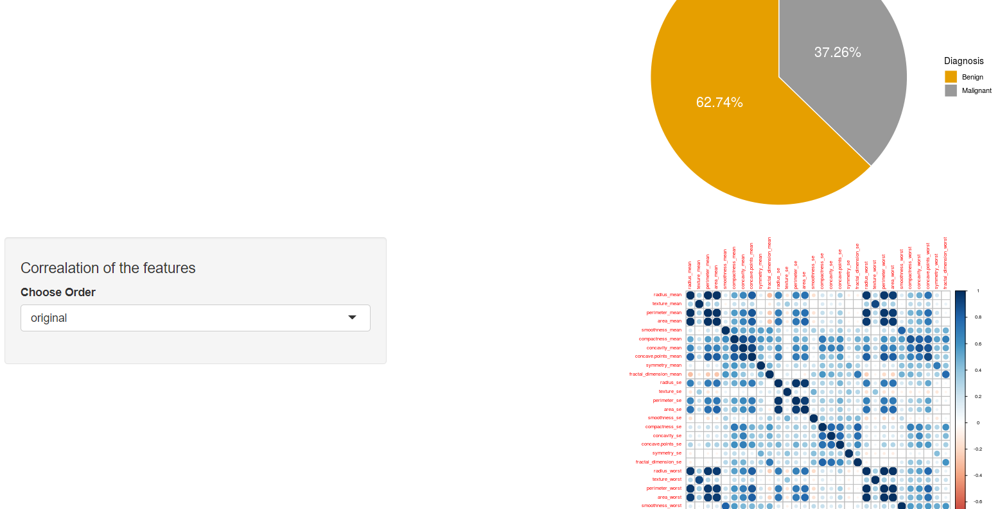

# Breast Cancer Wisconsin (Diagnostic) Data Set | Kaggle

### Groups
* 許育庭, 108753127
* 吳映函, 108753102
* 陳瑀芋, 108753144

### Goal

Our goal is to create a model that will allow us to predict whether a breast cancer cell is benign or malignant.

### Demo 

```R
Rscript code/your_script.R --data data/training --output results/performance.tsv
```
* on-line visualization 
* [Shiny Demo](https://leseryn.shinyapps.io/final_1/)


## Folder organization and its related information

### docs
* docs/1082_datascience_FP_group1.pptx

### data
* Source
	* Breast Cancer Wisconsin (Diagnostic) Data Set | Kaggle
	* [Kaggle Breast Cancer Wisconsin](https://www.kaggle.com/uciml/breast-cancer-wisconsin-data)
* Input format
	* One .csv file.
	* Attribute Information:
		* 1) ID number
		* 2) Diagnosis (M = malignant, B = benign)
		* 3-32) Ten real-valued features are computed for each cell nucleus:
			* a) radius (mean of distances from center to points on the perimeter)
			* b) texture (standard deviation of gray-scale values)
			* c) perimeter
			* d) area
			* e) smoothness (local variation in radius lengths)
			* f) compactness (perimeter^2 / area - 1.0)
			* g) concavity (severity of concave portions of the contour)
			* h) concave points (number of concave portions of the contour)
			* i) symmetry
			* j) fractal dimension ("coastline approximation" - 1)
		* The *mean*, *standard error* and *"worst" or largest* (mean of the threelargest values) of these features were computed for each image, resulting in 30 features. For instance, field 3 is Mean Radius, field 13 is Radius SE, field 23 is Worst Radius.
		* Which is 10 features x 3 measurements = 30 features

* Any preprocessing?
  * No missing data.
  * In the beginning, we use covariance matrix to do the PCA, but the Scree-plots suggest that using a covariance matrix is not the correct approach for calculating the principal components.
  * We chose correlation matrix to try again.

### code
* Which method do you use?
	* Decision tree
	* Naivebayes
	* Knn
	* Random forest
	* Generalized boosted regression models
	* Svm
	* PCA

* What is a null model for comparison?
	* Benign 0.6180905
	* Malignant 0.3819095
	* All guess benign

* How do your perform evaluation?
	* Cross-validation
	* AUC
	* ROC curve
	* accuracy


### results
* Which metric do you use 
  	* Using Accuracy, AUC, 'Positive' Class : Benign
	* Null-model: 0.5, x
	* Decision tree: 0.9532, 0.945
	* Naive Bayes: 0.9415, 0.932
	* Random forest: 0.9766, 0.967
	* Knn: 0.9357, 0.916
	* Svm: 0.9825, 0.983
	* Gradient boosting model: 0.9649, 0.958

* Is your improvement significant?
	* Yes , from 0.64 to 0.983
* What is the challenge part of your project?
	* It is hard to select the feature, we make efforts to do that.
	* We still need to refer to others.
	* Try methods and compare the difference.

## Reference
* [Reference 1](https://www.kaggle.com/shravank/predicting-breast-cancer-using-pca-lda-in-r)
* [Reference 2](https://www.kaggle.com/mirichoi0218/classification-breast-cancer-or-not-with-15-ml)
* [Reference 3](https://www.kaggle.com/paultimothymooney/decision-trees-for-binary-classification-0-99)
* [Reference 4](https://www.kaggle.com/kanncaa1/statistical-learning-tutorial-for-beginners/notebook)
* [Reference 5](https://www.kaggle.com/kanncaa1/statistical-learning-tutorial-for-beginners/notebook)
* [Reference 6](https://www.kaggle.com/bbloggsbott/feature-selection-correlation-and-p-value/data)
* [Reference 7](https://www.kaggle.com/uciml/breast-cancer-wisconsin-data/kernels)
* Packages
	* argparse
	* corrplot
	* caret
	* rpart
	* ROCR
	* e1071
	* randomForest
	* Formula
	* class
	* highcharter
	* gbm


